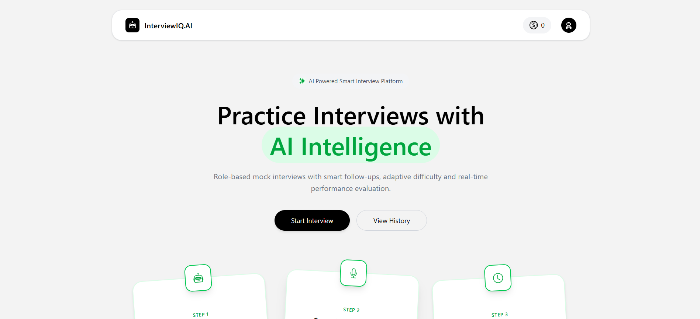
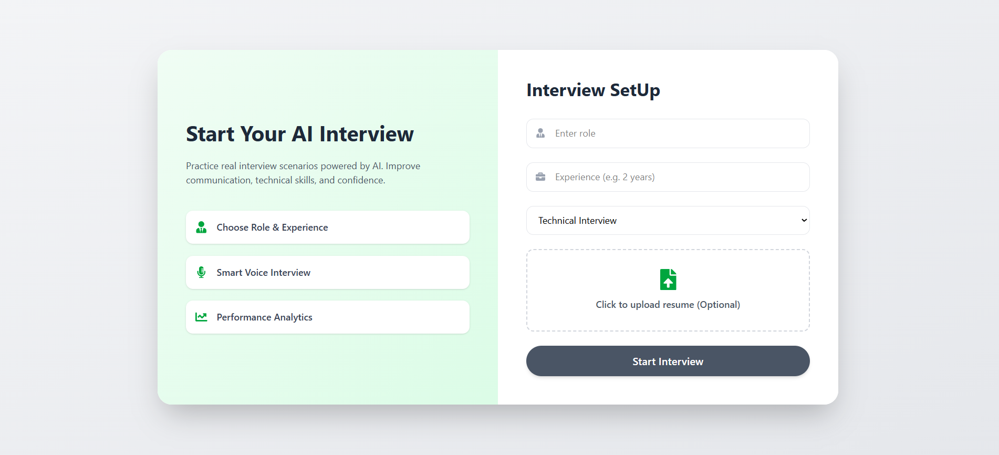
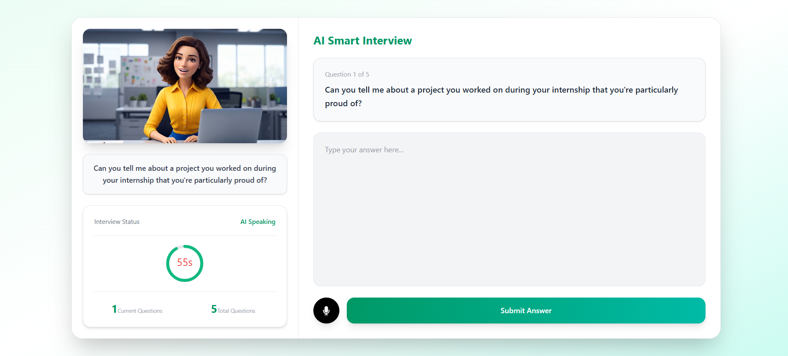
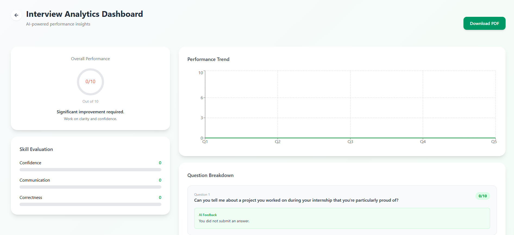

# AI Interview Agent

An AI-powered interview preparation platform that conducts personalized mock interviews based on the user's role, skills, or uploaded resume. Users can answer questions using their voice or by typing, making the interview experience more interactive and realistic.

## 🚀 Live Demo

🔗 **Live Demo:** - https://ai-interview-agent-5rom.onrender.com/

## 📸 Screenshots

### 🏠 Dashboard



### 🎯 Interview Setup



### 🎤 AI Interview



### 📊 Interview Results



---

## ✨ Features

- 🤖 **AI-Powered Interviews** — Generate personalized interview questions using AI.
- 📝 **Manual Interview Setup** — Enter your desired job role and skills manually.
- 📄 **Resume-Based Interview** — Upload a resume and let the AI analyze the candidate's role and skills.
- 🎤 **Voice Answering** — Answer interview questions by speaking.
- ⌨️ **Text Answering** — Type answers manually when preferred.
- 🗣️ **Speech-to-Text** — Convert spoken answers into text automatically.
- 🔐 **User Authentication** — Secure user authentication and session management.
- 📊 **Interview Dashboard** — View interview-related information and performance data.
- 📄 **PDF Reports** — Generate downloadable interview reports.
- 💳 **Payment Integration** — Integrated with Razorpay for payment-related functionality.
- 📱 **Responsive UI** — Built with React and Tailwind CSS.

---

## 🧠 How It Works

### 1. Choose Interview Information

Users can either:

- Enter their **job role and skills manually**
- Upload their **resume**

### 2. Resume Analysis

When a resume is uploaded, the application uses AI to analyze the resume and identify relevant information such as the candidate's role and skills.

### 3. AI Interview

Based on the provided information, the AI generates interview questions tailored to the candidate's profile.

### 4. Answer Questions

Users can answer questions in two ways:

- 🎤 Speak their answer using voice input
- ⌨️ Type their answer manually

Voice responses are automatically converted into text.

### 5. Interview Results

The application processes the interview data and presents the available results and performance information through the user interface.

---

## 🛠️ Tech Stack

### Frontend

- React 19
- Vite
- Tailwind CSS
- Redux Toolkit
- React Router DOM
- Axios
- Firebase
- Recharts
- jsPDF
- jsPDF AutoTable
- Motion
- React Icons

### Backend

- Node.js
- Express.js
- MongoDB
- Mongoose
- JWT
- bcrypt
- Multer
- Axios
- CORS
- Cookie Parser
- dotenv

### AI & Services

- OpenRouter API
- Razorpay
- Firebase
- MongoDB

---

## 🏗️ Project Structure

```text
ai-interview-agent/
│
├── client/
│   ├── public/
│   └── src/
│       ├── assets/
│       ├── components/
│       ├── pages/
│       ├── redux/
│       ├── utils/
│       ├── App.jsx
│       ├── App.css
│       ├── main.jsx
│       └── index.css
│
├── server/
│   ├── config/
│   ├── controllers/
│   ├── middlewares/
│   ├── models/
│   ├── routes/
│   ├── services/
│   │   ├── openRouter.service.js
│   │   └── razorpay.service.js
│   └── index.js
│
└── README.md